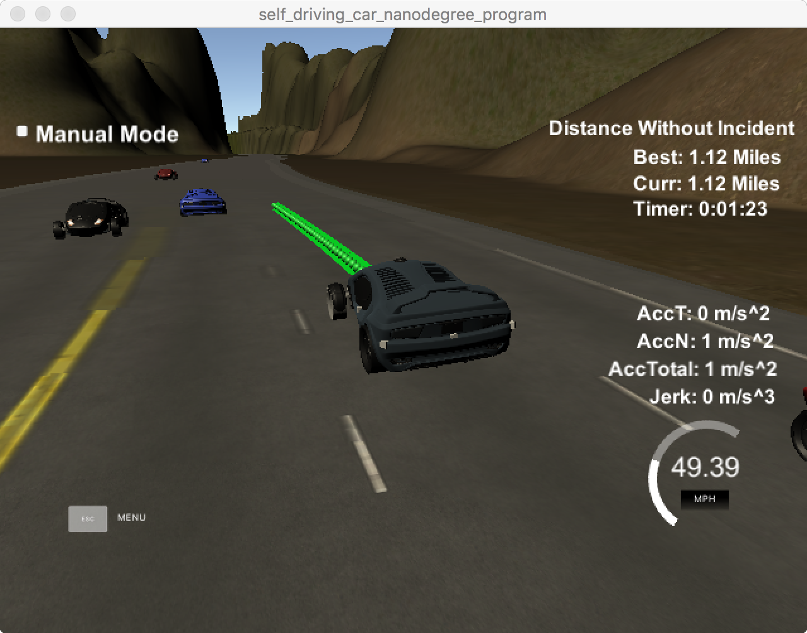

# CarND-Path-Planning-Project
Self-Driving Car Engineer Nanodegree Program

### Simulator.
You can download the Term3 Simulator which contains the Path Planning Project from the [releases tab (https://github.com/udacity/self-driving-car-sim/releases/tag/T3_v1.2).

### Goals
In this project your goal is to safely navigate around a virtual highway with other traffic that is driving +-10 MPH of the 50 MPH speed limit. You will be provided the car's localization and sensor fusion data, there is also a sparse map list of waypoints around the highway. The car should try to go as close as possible to the 50 MPH speed limit, which means passing slower traffic when possible, note that other cars will try to change lanes too. The car should avoid hitting other cars at all cost as well as driving inside of the marked road lanes at all times, unless going from one lane to another. The car should be able to make one complete loop around the 6946m highway. Since the car is trying to go 50 MPH, it should take a little over 5 minutes to complete 1 loop. Also the car should not experience total acceleration over 10 m/s^2 and jerk that is greater than 10 m/s^3.


This implementation is summarized in the following three steps

* Prediction : Analysing other cars positions.
* Behavior Planner: target, What should I do.
* Trajectory: How can I do it.

###Prediction
This part of the code deal with the telemetry and sensor fusion data. It intents to reason about the environment. In the case, we want to know three aspects of it:

* Is there a car in front of us blocking the traffic.
* Is there a car to the right of us making a lane change not safe.
* Is there a car to the left of us making a lane change not safe.

These questions are answered by calculating the lane each other car is and the position it will be at the end of the last plan trajectory. A car is considered "dangerous" when its distance to our car is less than 30 meters in front or behind us.

the code is reference from project walkthrough vedio.
and the kaiulrich's page: https://github.com/kaiulrich/kulrich-CarND-Path-Planning-Project

```
     // Find  other car number i  speed.
     double vx = sensor_fusion[i][3];
     double vy = sensor_fusion[i][4];
     double check_speed = sqrt(vx*vx + vy*vy);
     double check_other_car_s = sensor_fusion[i][5];


    // Estimate other car s position after executing previous trajectory.
     check_other_car_s += ((double)prev_size*0.02*check_speed);

     if ( other_car_lane == my_lane ) {
         // other Car in our lane.
         other_car_ahead = check_other_car_s > car_s && check_other_car_s - car_s < 30;
     } else if ( other_car_lane - my_lane == -1 ) {
         // other Car left
         other_car_left = car_s - 40 < check_other_car_s && car_s + 40 > check_other_car_s;
     } else if ( other_car_lane - my_lane == 1 ) {
         // other Car right
         other_car_righ = car_s - 40 < check_other_car_s && car_s + 40 > check_other_car_s;
     }

```

### Behavior

Based on the prediction of the situation we are in, this code increases the speed, decrease speed, or make a lane change when it is safe:

   * if other car is  ahead, think about change lane
  ```
      if ( !other_car_left && my_lane > 0 ) {
          // if there is no other car left and there is a left lane.
          my_lane--; // Change my_lane left.
      } else if ( !other_car_righ && my_lane != 2 ){
          // if there is no other car right and there is a right lane.
          my_lane++; // Change my lane right.
      } else {
          // slow down
          speed_diff -= MAX_ACC;
      }

  ```
  * if no other car is ahead, think about keep  in the middle lane (lane = 1).

  ```
    if ( my_lane != 1 ) { // if we are not on the center lane.
      // when I am on left and there is no other car on the right
      if ( my_lane == 0 && !other_car_righ ){
          my_lane = 1; // Back to center.

          // when I am on righ and there is no other car on the left
      }else if  ( my_lane == 2 && !other_car_left ) {
          my_lane = 1; // Back to center.
      }
    }

  ```

### Trajectory
This code does the calculation of the trajectory based on the speed and lane output from the behavior, car coordinates and past path points.

the code is reference from project walkthrough vedio.
First, the last two points of the previous trajectory (or the car position if there are no previous trajectory) are used in conjunction three points at a far distance(30m, 60 ,90m) to initialize the spline calculation).
then mainly use spline function to general a smooth line.
  ```

  // Setting up target points in the future.
   vector<double> next_wp0 = getXY(car_s + 30, 2 + 4*my_lane, map_waypoints_s, map_waypoints_x, map_waypoints_y);
   vector<double> next_wp1 = getXY(car_s + 60, 2 + 4*my_lane, map_waypoints_s, map_waypoints_x, map_waypoints_y);
   vector<double> next_wp2 = getXY(car_s + 90, 2 + 4*my_lane, map_waypoints_s, map_waypoints_x, map_waypoints_y);

^^^^^^^^^^^^^^^^
    // Create the spline.
      tk::spline spline;
      spline.set_points(ptsx, ptsy);

 ```

###result


